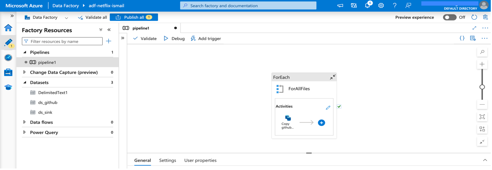

<h1>Data Ingestion Using Azure Data Factory</h1>

<!-- Introduction -->
<h2>Introduction</h2>

In this project, I designed dynamic pipelines in Azure Data Factory (ADF) to ingest multiple datasets from GitHub into Azure Data Lake Storage Gen2 (ADLS Gen2), enabling scalable and automated data ingestion.

<!-- Tools -->
<h2>Tools and Concepts</h2>

For this project, I used Azure Data Factory (ADF) and Azure Data Lake Storage Gen2 (ADLS Gen2) to implement key concepts such as data ingestion, dynamic pipelines, and efficient data organization within the storage account.

<!-- Understanding Dataset  -->
<h2>Understanding Dataset</h2>

I have four files on my GitHub page: netflix_cast.csv, netflix_category.csv, netflix_countries.csv, and netflix_directors.csv. I will ingest these files into Azure Data Lake using Azure Data Factory. To manage this process, I am using netflix_titles.csv as a validation file. I uploaded this file directly to the raw container in ADLS, and it will be used to ensure that the pipeline only runs when this file is available.

<h2>How I Set up ADLS and ADF</h2>

First, I created a resource group in the East US region to organize related Azure resources.

Inside this resource group, I set up Azure Data Factory (ADF) to handle data orchestration and an Azure Storage Account with Data Lake Storage Gen2 enabled to store and manage the ingested data.

<h2>Creating Containers in Azure Data Lake Storage Gen2</h2>

I created four containers called raw, bronze, silver, and gold in Azure Data Lake Storage Gen2 to organize data based on its processing stage. Files from GitHub are ingested into the bronze container. I also uploaded the file named netflix_titles.csv directly into the raw container to use it as a validation reference during pipeline execution.

<h2>Setting Up Linked Services in Azure Data Factory</h2>

After setting up the containers, I moved on to Azure Data Factory to set up linked services. These act like connection setups that let ADF access both the source and the destination.

Linked services act as connection strings that allow ADF to securely connect to various data sources and destinations, such as the GitHub data source and the Azure Data Lake Storage Gen2 containers.

In this project, I created one for GitHub to pull in the data and another for Azure Data Lake Storage Gen2, where the data gets stored. This setup is key to making the pipeline work end to end.

I created an HTTP linked service to connect to GitHub and an Azure Data Lake Storage Gen2 linked service to connect to ADLS.

<h3>Linked Services Used</h3>
  <ul>
    <li>
      <strong>Azure Data Lake Storage Gen2</strong> 
      <strong>Name:</strong> datalake_connection 
      <em>Used to connect to the ADLS Gen2 container where data is stored after ingestion.</em>
    </li>
     
    <li>
      <strong>HTTP (GitHub)</strong> 
      <strong>Name:</strong> github_ismail 
      <em>Configured to access raw data files hosted on a public GitHub repository.</em>
    </li>
  </ul>

<h2>Understanding the Need for a Dynamic Pipeline</h2>

Before building the pipeline, it was necessary to determine the most efficient approach. Since all the GitHub files shared a common relative URL, the only variation was in the file names. To handle this efficiently, I created a dynamic pipeline using parameters. This allowed a single pipeline to process multiple files by simply passing different file names as input, making the solution scalable and easier to maintain.

<h3>netflix_cast.csv</h3>

<h3>netflix_category.csv</h3>

<h3>netflix_countries.csv</h3>

<h3>netflix_directors.csv</h3>

If you look at the screenshot above, you’ll notice that all the files share the same relative URL, with only the file names varying. Because of this, I created a dynamic pipeline that uses parameters to handle the different file names. This allows me to use a single pipeline to ingest all the files easily, without needing to build separate pipelines for each one. It’s a straightforward but effective way to keep the process scalable and efficient.

Base URL: https://raw.githubusercontent.com/

<h2>How I Set Up My Azure Data Ingestion Pipeline </h2>

Once the linked services were set up, I navigated to the Author section in Azure Data Factory to create a new pipeline. The first activity I added was the Copy Activity, which copies files from the GitHub source and writes them to the ADLS Gen2 destination.

<h3>Creating Source and Sink Datasets for the Copy Activity</h3>

As I began configuring the Copy Activity, the first step was to create new datasets for both the source and the sink. For the source dataset, I selected HTTP as the data store and chose CSV as the file format, since the GitHub files were in CSV format. I then linked it to GitHub using the HTTP linked service I had previously set up.

Similarly, for the sink dataset, I chose Azure Data Lake Storage Gen2 as the data store and selected CSV as the file format to match the source. I used the ADLS Gen2 linked service I had already set up to connect to the destination.

<h3>Creating Source Parameter for the Copy Activity</h3>

In the Copy Activity source, I set up a parameter called file_name because all the files share the same relative URL, with only the file name changing. The relative URL is the part of the path that comes after the base URL. By using the file_name parameter, the pipeline can build the full file path dynamically during execution. This allows a single Copy Activity to handle multiple files easily without needing to create separate pipelines or steps for each one.

After creating the parameter, I used the pipeline expression builder to set the relative URL. I kept the entire relative URL the same except for the file name, where I used the parameter, I created. This way, the pipeline can dynamically insert different file names during execution.

<h3>Creating Sink Parameter for the Copy Activity</h3>

Similarly, I created two parameters for the sink: folder_name and file_name. This setup lets me control exactly where each file should be placed in the storage account, organizing them into specific folders based on their content or source.

After creating the parameters for the sink, I set the directory path to bronze and used the folder_name and file_name parameters to define exactly where each file should be stored. This helped organize the ingested files into structured folders within the bronze container, making the data easier to manage and work with downstream.

<h3>Parameter Values in Dynamic Pipelines</h3>

After setting up the parameters for both the source and sink and referencing them in the relative URL and file path, I needed to provide actual values for each parameter. These values help the pipeline know which file to pull from the source and where exactly to place it in the sink, making the data flow specific to each dataset.

<h3>How I Set Up Parameter Values in Dynamic Pipelines</h3>

To make use of the parameters for different files, I used the ForEach activity in Azure Data Factory. The ForEach activity helps repeat a set of steps for every item in a list. In my setup, I created an array parameter that holds values in JSON format. Each entry contains a folder name and a file name. This allowed the pipeline to loop through the list and process each file one by one using the same dynamic structure.

JSON File: https://github.com/ismailshaikh8/Azure_Netflix_DE_Project/blob/main/Phase%201%20-%20Data%20Ingestion/array.json

Once the array was created, I used it in the settings of the ForEach activity to configure the items it would iterate over. This setup allowed the pipeline to loop through each file and folder combination from the array and process them accordingly.

<h3>Embedding the Copy Activity within the ForEach loop</h3>

After setting up the ForEach activity, I placed the Copy Activity inside it. This way, the loop can run through each item in the array and use the Copy Activity to transfer data from the source to the sink for each file. It ensures that every file is processed one by one based on the parameters defined.

<h3>Passing Dynamic Values to Copy Activity Parameters</h3>

After configuring the ForEach activity, I provided the actual values to the parameters in both the source and sink settings of the Copy activity. For the source, I used @item().file_name, and for the sink, I used both @item().folder_name and @item().file_name. This setup ensures that during each iteration, the pipeline dynamically picks the right file from the source and places it into the correct folder in the destination.

<h3>Using Validation Activity to Control Pipeline Execution</h3>

I used the Validation activity in Azure Data Factory to check whether the netflix_titles.csv file exists in the raw container. Only if the file is present does the pipeline proceed with the ForEach activity. This ensures that the ingestion process only runs when the expected data is available.

I had already uploaded the netflix_titles.csv file into the raw container. To ensure the pipeline doesn't run unnecessarily, I used the Validation activity to confirm the file’s presence. Only when the file is found does the pipeline move forward with the ForEach loop to ingest data into the bronze container.

<h3>Running the pipeline</h3>

After setting up the Validation, ForEach, and Copy activities, I went ahead and triggered the pipeline. It ran successfully, first checking for the netflix_titles.csv file in the raw container, and then looping through the files to load them into the bronze container without any issues.

<h2>Success</h2>

