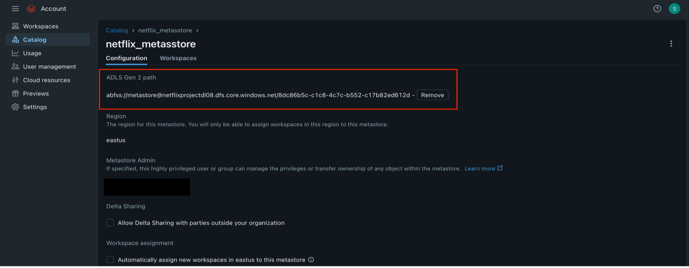

<h1>How I Implementing Unity Catalog, Auto Loader, and Automated Data Ingestion Using Databricks Workflows</h1>

<!-- Overview -->
<h2>Overview</h2>

This project demonstrates an end-to-end data ingestion pipeline using Azure Databricks, leveraging Unity Catalog for data governance, Auto Loader for incremental data ingestion, and Databricks Workflows for pipeline automation.

<!-- Prerequisites -->
<h2>Prerequisites</h2>

I created five containers in ADLS Gen2: bronze, silver, gold, raw, and metastore. Using Azure Data Factory (ADF), I ingested the following files into the data lake: netflix_cast.csv, netflix_category.csv, netflix_countries.csv, and netflix_directors.csv. Additionally, I manually uploaded the netflix_titles.csv file directly into the raw container.

  
  

<!-- How I Set Up Unity Catalog -->
<h2>How I Set Up Unity Catalog</h2>
<h3>Create Databricks resource:</h3>

I set up a Databricks workspace called “netflix-adb-ismail” within my Azure resource group.

<h3>How I created the Access connector and assigned the role:</h3>

Before setting up unity catalog. I created a resource called “Access connector for Azure Databricks”, which acts as a connection between the Databricks and Azure Data Lake storage.

The Resource ID which gets generated by “Access Connector for Azure Databricks” is an authentication ID which allows the Databricks to access the Azure Data Lake.

Then I assigned the access connector the “Storage Blob Data Contributor” role to the storage account. By this databricks will be able to access the storage account.

<h3>How I created Unity Catalog Metastore:</h3>

I created a Unity Catalog metastore using the Databricks account console. During the setup process, I used the Resource ID from the “Access Connector for Azure Databricks” named “access_netflix”, which I had created earlier. This allowed Databricks to securely access Azure Data Lake Storage.  
I then configured the metastore by providing the ADLS Gen2 path that points to the “metastore” container. I created this container specifically to store all the metadata managed by Unity Catalog, including information about schemas, tables, and permissions.

After setting it up, I assigned the Databricks workspace I created i.e. “netflix-adb-ismail” to this metastore so it can start using Unity Catalog for data governance and access control.

<h3>How I Created Catalog in Databricks:</h3>

After configuring the meta store in Databricks account console. I created a catalog in Databricks.

After creating the catalog, I set up external locations in ADLS Gen2 at the container level. This enabled me to access and store data in the “bronze”, “silver”, “gold”, and “raw” containers directly from Databricks.

<!-- How I Implemented Incremental Data Ingestion Using Auto Loader in Databricks -->
<h2>How I Implemented Incremental Data Ingestion Using Auto Loader in Databricks</h2>

I used Databricks Auto Loader to continuously detect and ingest new CSV files arriving in the “raw” container. To manage schema changes and track progress, I set a checkpoint location in the “silver” container. This ensures only new files are processed without duplication. The incoming data is then written as a Delta table in the bronze container.

<i>
Reading Data from the Raw Container Using Spark Structured Streaming in Databricks PySpark Notebook
</i>
<pre><code class="language-python">
df = spark.readStream \
  .format("cloudfiles") \
  .option("cloudFiles.format", "csv") \
  .option("cloudFiles.schemaLocation", "abfss://silver@netflixprojectdl08.dfs.core.windows.net/checkpoint") \
  .load("abfss://raw@netflixprojectdl08.dfs.core.windows.net")
  </code></pre>
  
<i>
Writing Data to the Bronze Container Using Spark Structured Streaming in Databricks PySpark Notebook
</i>
<pre><code class="language-python">
df.writeStream \
  .option("checkpointLocation", "abfss://silver@netflixprojectdl08.dfs.core.windows.net/checkpoint") \
  .trigger(availableNow=True) \
  .start("abfss://bronze@netflixprojectdl08.dfs.core.windows.net/netflix_titles")
  </code></pre>
  

Once the incremental load ran successfully, the “netflix_titles” file from the “raw” container was ingested into the “bronze” container. The schema information was also captured and stored in the checkpoint folder inside the “silver” container to help track structure and manage future data loads.

<!-- How I Automated Data Pipelines with Databricks Workflows -->
<h2>How I Automated Data Pipelines with Databricks Workflows</h2>
<h3>How I created the parameter in Notebook:</h3>

With all the files in the bronze layer, I needed to move them to the silver layer and perform data quality checks. Instead of processing each file manually, I set up parameters in the notebook using “dbutils.widgets” to automate the reading and writing tasks. This approach made the workflow more efficient and easier to manage.  
I set the default source and target parameters as “netflix_cast” and stored them in variables “var_src” and “var_tgt”. This allowed me to use these variables in my read and write scripts, so the data could be dynamically read from “bronze” container and written to the “silver” container.

<i>
Creating the Parameters
</i>
<pre><code class="language-python">
dbutils.widgets.text("Sourcefolder","netflix_cast")
dbutils.widgets.text("targetfolder","netflix_cast")
  </code></pre>

<i>
Placing the parameter in a variable
</i>
<pre><code class="language-python">
var_src = dbutils.widgets.get("Sourcefolder")
var_tgt = dbutils.widgets.get("targetfolder")
  </code></pre>

<i>
Reading the Data from the bronze Container Using the Source variable
</i>
<pre><code class="language-python">
df = spark.read.format("csv") \
    .option("header", True) \
    .option("inferSchema", True) \
    .load(f"abfss://bronze@netflixprojectdl08.dfs.core.windows.net/{var_src}")
  </code></pre>
  
<i>
Writing the data in silver container Using the target variable
</i>
<pre><code class="language-python">
 df.write.format("delta")\
     .mode("append")\
     .option("path",f"abfss://silver@netflixprojectdl08.dfs.core.windows.net/{var_tgt}")\
     .save()
  </code></pre>

<h3>How I created the lookup array:</h3>

With the parameters and script ready, I created a lookup array in the form of a JSON file that defined the source and target locations. This setup allowed me to easily manage multiple data paths dynamically within the pipeline.  
I used “dbutils.jobs.taskValues” to set key-value pairs, including the array name “folders”, which stored multiple parameters.

<i>
Lookup List</i>
<pre><code>
folders = [
    {
        "Sourcefolder": "netflix_cast",
        "targetfolder": "netflix_cast"
    },
     {
        "Sourcefolder": "netflix_category",
        "targetfolder": "netflix_category"
    },
    {
        "Sourcefolder": "netflix_countries",
        "targetfolder": "netflix_countries"
    },
    {
        "Sourcefolder": "netflix_directors",
        "targetfolder": "netflix_directors"
    }
]
</code></pre>

<pre><code>
dbutils.jobs.taskValues.set(key = 'files' , value = folders)
</code></pre>

<h3>How I created the Databrick workflow:</h3>

I created a Databricks job called “folder_lookup” which runs a notebook responsible for handling the JSON file containing folder configurations. Then, I created a separate job called “Silver_load_iteration” that runs the notebook where I defined parameters and implemented the data read and write operations.  
I added a “lookup task” at the start of the “Silver_load_iteration” job so that it runs once for every path defined in the “folder_lookup” notebook. This way, the job processes each folder dynamically without manual intervention.

<!-- Success -->
<h2>Success</h2>

After running the pipeline, it completed successfully, and all the folders were loaded from the bronze container into the silver container.

